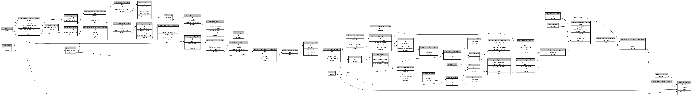

```
# AUTOGENERATED BY ECOSCOPE-WORKFLOWS; see fingerprint in README.md for details

```

```yaml
# fingerprint:
artifacts_sha256_basic: 20af3cd6356ea6e8f5b83aaef9c3933e579290e0e614947b0b31ac63ee7d6f6b
artifacts_sha256_strict: 75fc307a8eb10f536ef03edff0a30c67f3ac743779d62c60e7b942ac03928de8
installed_requirements:
- channel: https://repo.prefix.dev/ecoscope-workflows/
  name: ecoscope-platform
  version: {version: ==2.16.0}
- channel: https://repo.prefix.dev/ecoscope-workflows-custom/
  name: ecoscope-workflows-ext-custom
  version: {version: ==0.1.0rc14}
- channel: https://repo.prefix.dev/ecoscope-workflows-gcf/
  name: ecoscope-workflows-ext-gcf
  version: {version: ==0.1.1}
params_sha256: 2dabd8f671c6e89eb2c34471c315a79c0a7c23c1c382c5f1ca3baa29f54a91e1
spec_sha256: c7dacb6a974944ef0c480f3d96b3094d119d6ee1647e9d92fd0d629766ff56e6

```

# ecoscope-workflows-gcf-patrol-download-workflow


